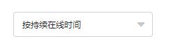

# vue + ts - template

## 开发环境
  - Node.js       v10+
  - Vue           v2.6.11
  - Vue-Cli       v4.3.1
  - typescript

  ```
1、安装 Node.js
	网址：https://nodejs.org/zh-cn/
	选择 LTS 版本

2、npm、cnpm、yarn（默认使用）有个别包只有在固定包管理工具下才能成功安装，建议都安装上

3、安装 cnpm 并使用淘宝镜像加速下载依赖
	npm install -g cnpm --registry=https://registry.npm.taobao.org

4、全局安装 yarn
	cnpm install -g yarn

5、安装依赖（可以使用 yarn 安装，速度相对会快一些）
	yarn

6、配置包（已安装）
	yarn add -D @gfx/zopfli compression-webpack-plugin brotli-webpack-plugin webpack-bundle-analyzer style-resources-loader babel-plugin-transform-remove-console @types/qs

工具包声明文件，某些工具包编译器识别需要辅助声明文件，例如：@types/clipboard @types/echarts

7、缓存编译模块，提升编译和构建速度
	yarn dll

8、运行开发环境
	yarn serve
  ```

## git 分支管理（各司其职）

  ```
1、develop 分支   -- 服务器-拉取 测试 环境编译构建源码
2、release 分支   -- 服务器-拉取 灰度 环境编译构建源码
3、master 分支    -- 服务器-拉取 正式 环境编译构建源码
4、beta 分支      -- 开发环境- 测试 环境源码，用于构建 测试 环境源码
5、rc 分支        -- 开发环境- 灰度 环境源码，用于构建 灰度 环境源码
6、build 分支     -- 开发环境- 正式 环境源码，用于构建 正式 环境源码
7、share 分支     -- 开发环境-全局公共配置、工具等改动都得在此分支改，
                    个人分支再拉取，所有个人或功能分支共享更改，减少维护量和易出错，
                    当 build 发布稳定后，从 build 同步到 share，
                    保持 share 与 build 同步，避免后续分支合并、拉取冲突
8、个人或功能分支  -- 从 build 分支中切新分支开发
  ```

## 自动化打包部署到git（必须在指定分支部署）

  ```
1、在开发项目目录同级路径下，再次从 git 中 clone 一份出来，更改文件夹名为 项目名_build
    例如：
        开发项目路径：E:\project\yunfadan_seller
        部署项目路径：E:\project\yunfadan_seller_build

2、部署-测试环境
    将当前分支切换到 beta 分支，将要部署的分支合并到 beta 分支，
    开启命令行终端，进入当前项目目录
    执行部署命令：
        yarn beta

3、部署-灰度环境
    将当前分支切换到 release 分支，将要部署的分支合并到 release 分支，
    开启命令行终端，进入当前项目目录
    执行部署命令：
        yarn rc

4、部署-正式环境
    将当前分支切换到 build 分支，将要部署的分支合并到 build 分支，
    开启命令行终端，进入当前项目目录
    执行部署命令：
        yarn build
  ```

## npm 包问题

- [webpack图片压缩image-webpack-loader无法安装或安装卡死的解决办法](https://my.oschina.net/itlangz/blog/1921136)

## 使用 ui库

  ```
1、执行对应 ui 库包安装命令
2、在 vue+ts-template\src\register 目录下创建 ui文件
3、在 ui 文件中执行按需引入
4、在 vue+ts-template\src\register\index.ts 中导入 ui文件
5、在 vue+ts-template\env.js 输入要按需打包的 ui框架名
6、重启开发环境服务

例如：element-ui
    1、安装 yarn add element-ui -S
    2、在 vue+ts-template\src\register 目录下创建 element-ui.ts 文件
    3、在 element-ui.ts 文件中执行按需引入
        import Vue from 'vue'

        // 根据使用需求确定是否需要引入 icon
        // import 'element-ui/lib/theme-chalk/icon.css'

        import { Button } from 'element-ui'

        const components: any[] = [ Button ]

        components.forEach(component => Vue.use(component))

    4、在 vue+ts-template\src\register\index.ts 中导入 element-ui.ts文件
    	import './element-ui'
    5、在 vue+ts-template\env.js 输入要按需打包的 ui框架名
      ui: 'element-ui'
    6、yarn serve

例如：ant-design-vue
    1、安装 yarn add ant-design-vue -S
    2、在 vue+ts-template\src\register 目录下创建 antd 目录
    3、在 antd 目录下 创建 index.ts 和 icons.ts（如果有用到图标） 文件
    4、在 index.ts 文件中执行按需引入
        import Vue from 'vue'

        // 根据使用需求确定是否需要引入 icon
        // import 'element-ui/lib/theme-chalk/icon.css'

        import { Button } from 'element-ui'

        const components: any[] = [ Button ]

        components.forEach(component => Vue.use(component))

    5、在 icons.ts 文件中执行按需引入图标
      1、鼠标右键检查组件使用图标类名，例如 DatePicker组件 =》 <i aria-label="icon: calendar"></i> => 图标名称为：calendar
      2、去官网 Ctrl+F 使用图标名称找 https://www.antdv.com/components/icon-cn/
      3、注意：图标有好几种主题，在 Select the Icon Theme 下面，在某个主题下找不到再切换到其它主题继续找
      4、例如在 Outlined 主题下找到 icon，那么就进入 @ant-design/icons/lib/outline（主题目录） 下找
          一般图标命名规则为：图标名称首字母大写 + 主题首字母大写
          注意：找的是 图标名.ts 文件
      5、导出图标进行打包，例如
        export { default as CalendarOutline } from '@ant-design/icons/lib/outline/CalendarOutline'

    6、在 vue.config.js 中搜索 @ant-design/icons/lib/dist$，取消注释，将要打包图标的路径指定为刚创建的 icons.ts 文件所在路径

    7、在 vue+ts-template\src\register\index.ts 中导入 antd/index.ts文件
    	import './antd'
    8、在 vue+ts-template\env.js 输入要按需打包的 ui框架名
      ui: 'ant-design-vue'
    9、yarn serve
  ```

## 移动端项目

```
1、安装开发依赖
	yarn add -D postcss-plugin postcss-px-to-viewport postcss-viewport-units
2、postcss.config.js 解除 postcss 插件配置注释
```

## 开发环境设计思想：支架式设计，配置式驱动

  - 把一个大体的架构划分成一个个子支架，子支架下管理着自己的子支架，例如：

    ```
    配置、错误处理、注册器、过滤器、接口请求响应、工具、通用组件封装等
    ```

## 开发约定

- 命名

  - 命名要见名知意，简洁明了，让代码会说话，减少不必要的注释，严禁出现 拼音数字 组合命名方式，统一使用有具体意义的英文单词命名
    可参照 google 翻译，网址：https://translate.google.cn/

  - 类（文件或文件夹）统一使用 大驼峰命名法，例如：ProductDetail
    例如：.vue 结尾、封装的 js 类文件 等

  - 普通（文件或文件夹） 统一使用 横线命名法，例如：product-detail
    例如：.sass、.js、.html 等 结尾

  - 常量数据统一使用全大写，多个单词使用 _ 分割，例如：PRODUCT_DETAIL

  - 普通数据统一使用小驼峰，例如：productDetail

  - css 类名统一使用横线，例如：product-detail

  - 全局样式统一使用 g-类名，例如：g-color

- 数据类型定义

  - 常量数据（数据一经定义永不改变）类型 或 引用类型（json、array、date等）如果确定不会发生替换操作，统一使用 const 声明，例如：

    ```
    const json = {}
    const TOTAL_COUNT = 100
    const DOMAIN = 'https://www.baidu.com'
    ```

  - 统一使用 函数直接量 方式创建函数，例如:

    ```
    const foo = () => {} 或 const bar = { foo() {} }
    ```

- z-index 使用约定

  - 底部轮播图 -100~0
  - 基本 0~100
  - 内容层 100~200
  - 头部、导航 200~300
  - 蒙版 300~400
  - 悬浮窗 500~600
  - 悬浮窗按钮 600~700

- 注意事项

  - 在进行条件判断时，使用全等(===)进行判断

  - 严禁出现 !user 这种判断，必须要判断到对应的数据类型，例如：user !== null

  - 尽量使用 continue, break, return 减少 if else 嵌套

  - 条件判断比较多时，使用 json 来添加 映射关系，使代码设计更清晰可读

  - 组件设计保持单一性，把使用组件的使用交给外部控制，减少组件内部逻辑

  - 路由 path 使用小写单词，多个单词之间使用 - 分割

  - 每个路由配置项都要写 meta 元数据项，例如：

    ```
    {
      path: '/xxx',
      name: 'xxx',
      meta: {
        // 页签标题（必填）
        title: 'xxx',
        // 是否需要登录授权
        loginAuth: true
      }
    }
    ```

  - 不要在模板层（template）写逻辑，保留单一性，模板只做渲染，逻辑放在 js 处理，可通过 computed 获取响应性

  - 全局样式在 App.vue => style 引入

    <style lang="sass">
    @import '@/assets/sass/index.sass'
    </style>

## 配置解析

```
# .env 环境配置 所有环境共用

# 默认使用 测试环境地址
# API 地址
VUE_APP_API_URL = ''
# WebSocket 地址
VUE_APP_WS_URL = ''
```

```
# .env.production 生产环境配置
NODE_ENV = 'production'

# API 地址
VUE_APP_API_URL = ''
# WebSocket 地址
VUE_APP_WS_URL = ''
```

```
# .env.release 预发布环境配置

# 注意，如果使用预发布配置，需要在前端公共库下载前端服务器测试环境 release-test， 将该目录拷贝到与当前项目同级的位置，
# 如果目录不一致也没事，自己调整一下 OUTPUT_DIR 指向 前端服务器预发布测试环境 所在目录

# 将部署的文件输出到前端服务器资源目录下，刷新启动好的服务器地址(127.0.0.1:3000 / ip:3000 局域网共享)验证打包文件展示是否正确
OUTPUT_DIR = '../release-test/public'
```

```
# package.json

"scripts": {
  // 模块编译缓存，提升编译和构建速度
  "dll": "webpack -p --progress --profile --colors --config ./webpack.dll.config.js",
  // 单元环境
  "test:unit": "vue-cli-service test:unit",
  // 语法验证
  "lint": "vue-cli-service lint",
  // 开发环境
  "serve": "vue-cli-service serve",
  // 部署测试环境
  "beta": "sh ./deploy.sh develop",
  // 部署灰度环境
  "rc": "sh ./deploy.sh release",
  // 部署正式环境
  "build": "sh ./deploy.sh master",
  // 打包分析环境，注意：--mode analyz 指定使用哪个模式的配置文件，此处使用 .env.analyz
  "analyz": "vue-cli-service build --mode analyz",
  // 测试环境真正部署git分支命令，在部署测试环境中做了命令跳转，可忽略不看
  "develop": "vue-cli-service build --mode beta",
  // 灰度环境真正部署git分支命令，在部署灰度环境中做了命令跳转，可忽略不看
  "release": "vue-cli-service build --mode production",
  // 预发布环境（在前端本地服务器验证打包文件是否正常运行）
  "release.local": "vue-cli-service build --mode release.local",
  // 正式环境真正部署git分支命令，在部署正式环境中做了命令跳转，可忽略不看
  "master": "vue-cli-service build"
}
```

## 项目结构

+ 注意：
  + 这是一套模板，为了便于理解和使用，加入了一些项目中可能用到的文件，根据自己项目将不需要的删掉
  + **architecture** 目录 是项目的基础架构，是真的 **不能删**
  + 使用 vue.config.js 定义的路径别名管理路径前缀，使其清晰简短
    例如: 引用 Login 页面下的 bg.png => @viewsImg/Login/bg.png

```
│  .browserslistrc 	# 目标浏览器和 node 版本的配置
│  .editorconfig   	# 编辑器配置，换行符、缩进等
│  .env				      # 开发环境配置
│  .env.analyz		  # 生产环境打包分析配置
│  .env.beta		    # 测试环境配置
│  .env.production  # 生产环境配置
│  .env.release	  	# 预发布测试环境配置
│  .eslintrc.js	  	# eslint 代码检查配置
│  .gitignore  		# git 忽略提交文件配置
│  .postcssrc.js  	# postcss 代码配置，适合移动端
│  .prettierrc.js  	# prettier 代码格式化配置
│  babel.config.js  # babel 编译 配置
│  jest.config.js  	# jest 测试配置
│  package.json  	# 项目包配置
│  README.md  		# 项目描述，看项目之前习惯性先看 README 文件
│  tsconfig.json	# ts 环境配置
│  vue.config.js	# vue 环境 webpack 配置
│
├─public			# 公共目录，用于存放静态资源
│      favicon.ico	# 页签图标
│      index.html	# 打包渲染 index.html 文件模板
│
├─src				# 源码目录
│  │  App.vue		# 入口组件
│  │  main.ts		# 程序入口
│  │  shims-tsx.d.ts # JSX语法全局命名空间，tsconfig 内开启了jsx语法支持后，自动识别 .tsx 文件
│  │  shims-vue.d.ts # 外部模块定义,主要为项目内所有的 .vue 文件做模块声明
│  │
│  ├─api				# 接口目录,存放所有api，可按页面名来命名文件夹，便于管理和维护
│  │  └─common			# 公共接口目录
│  │          index.ts	# 入口
│  │
│  ├─assets							# 资源目录
│  │  ├─images						# 图片目录
│  │  │  ├─architecture				# 架构（不能删）图片目录
│  │  │  │      loading-fail.png
│  │  │  │      loading-lazy.gif
│  │  │  │      loading.gif
│  │  │  │
│  │  │  └─global					# 全局图片目录
│  │  │  └─views					# 所有页面图片目录，以页面名为目录名存放每个页面的图片
│  │  │
│  │  └─sass						# saas 全局样式目录
│  │      │  index.sass				# 入口
│  │      │
│  │      ├─architecture			# 架构（不能删）样式目录
│  │      │  │  animation.sass		# 动画类
│  │      │  │  icon.sass			# 图标
│  │      │  │  index.sass			# 入口
│  │      │  │  keyframe.sass		# 动画函数
│  │      │  │  loading.sass		# 加载
│  │      │  │  message.sass		# 操作提示信息
│  │      │  │  mixin.sass			# 混入函数
│  │      │  │  reset.sass			# 重置浏览器默认样式
│  │      │  │
│  │      │  └─variables			# 变量目录
│  │      │          animation.sass	# 动画
│  │      │          index.sass		# 公共
│  │      │
│  │      ├─business				# 全局业务样式目录
│  │      │  │  index.sass			# 入口
│  │      │  │
│  │      │  └─variables
│  │      │          index.sass		# 入口
│  │      │
│  │      └─global					# 全局公共样式目录
│  │          │  index.sass			# 入口
│  │          │
│  │          ├─common				# 公共样式目录
│  │          │      btn.sass		# 按钮
│  │          │      color.sass		# 颜色
│  │          │      flex.sass		# 弹性布局
│  │          │      index.sass		# 入口
│  │          │      list.sass		# 列表
│  │          │      other.sass		# 其它的
│  │          │      overflow.sass	# 溢出
│  │          │      position.sass	# 定位
│  │          │      table.sass		# 表格
│  │          │      tip.sass		# 提示信息，上下左右带三角形（鼠标滑动）
│  │          │      triangle.sass	# 三角形
│  │          │
│  │          └─variables			# 变量目录
│  │                  index.sass	# 入口
│  │
│  ├─components						# 组件目录
│  │  ├─business					# 业务组件
│  │  └─global						# 全局公共组件，自动注册，文件名为组件名
│  │          Checkbox.vue			# 复选框
│  │          Checkboxs.vue			# 复选框列表，带全选
│  │          CustomProgress.vue	# 自定义进度条
│  │          Dialog.vue			# 蒙板对话框
│  │          DialogFooter.vue		# 对话框页脚按钮
│  │          Dropdown.vue			# 下拉框
│  │          Help.vue				# 帮助提示，鼠标移动显示提示信息
│  │          IconCollapse.vue		# 图标收缩，控制内容显示和隐藏
│  │          Modal.vue				# 蒙版
│  │          NextPage.vue			# 下一页
│  │          Pagination.vue		# 分页器，同 JQ 一致
│  │          Radios.vue			# 单选框列表
│  │          Tab.vue				# 页签
│  │          TabItem.vue			# 页签项，在页签组件中使用
│  │          Tip.vue				# 提示组件，鼠标移动
│  │          Top.vue				# 置顶
│  │
│  ├─config
│  │  ├─architecture				# 架构（不能删）配置
│  │  │      api.ts					# api 配置
│  │  │
│  │  ├─business					# 业务配置
│  │  └─global						# 公共配置
│  ├─filter							# 过滤器，自动注册
│  │  ├─business					# 全局业务过滤器
│  │  │      index.ts				# 入口
│  │  │
│  │  └─global						# 全局公共过滤器
│  │          date.ts				# 日期
│  │          money.ts				# 金额
│  │          number.ts				# 数字
│  │          other.ts				# 其它
│  │
│  ├─http							# http 请求目录，api 接口，不能删
│  │      index.ts					# 入口
│  │      timer.ts					# 时间工具，控制 loading 是否展示 及 延时
│  │
│  ├─interface
│  │  ├─architecture				# 架构（不能删）
│  │  │      index.ts				# 入口
│  │  │
│  │  ├─business					# 业务接口
│  │  │      index.ts				# 入口
│  │  │      user.ts				# 用户
│  │  │
│  │  └─global						# 全局接口
│  │          index.ts				# 入口
│  │
│  ├─mixins							# mixins 目录，组件 js 逻辑复用
│  │  ├─business					# 业务 mixins
│  │  └─global						# 全局 minxis
│  │          dialog.ts				# 弹窗
│  │          request.ts			# 请求，用于请求前后设置 loading 态及是否有响应数据判断
│  │          tab.ts				# 页签，不能删
│  │
│  ├─register						# 注册目录，Vue 实例化前执行
│  │      component.ts				# 全局组件，自动注册
│  │      filter.ts					# 全局过滤器，自动注册
│  │      index.ts					# 入口
│  │      other.ts					# 其它
│  │      prototype.ts				# 要挂载到 Vue.prototype 上的工具
│  │
│  ├─router							# 路由目录
│  │      index.ts					# 入口
│  │
│  ├─type							# 类型目录，适用于自定义变量类型，约束变量的行为
│  │  ├─architecture				# 架构（不能删）类型
│  │  │      index.ts				# 入口
│  │  │
│  │  ├─business					# 业务类型
│  │  │      index.ts				# 入口
│  │  │
│  │  └─global						# 全局类型，不能删
│  │          index.ts				# 入口
│  │
│  ├─utils							# 工具目录
│  │  ├─architecture				# 架构（不能删）工具
│  │  │      counter.ts				# 计数器
│  │  │      download.ts			# 资源下载
│  │  │      loading.ts				# 加载
│  │  │      message.ts				# 操作提示信息
│  │  │
│  │  ├─business					# 业务工具
│  │  └─global						# 全局工具
│  │          animation.ts			# 动画
│  │          copy.ts				# 复制
│  │          date.ts				# 日期
│  │          event.ts				# 事件
│  │          lib.ts				# 工具库
│  │          scroll.ts				# 滚动条
│  │          sessionStorage.ts		# 会话存储
│  │          verify.ts				# 验证
│  │
│  └─views							# 页面视图目录
│      └─Index						# 页面目录
│              Index.vue			# 入口
│
└─tests								# 测试目录
    └─unit							# 单元测试
            example.spec.ts			# 测试文件
```

## 组件 UI

│  ├─components						# 组件目录
│  │  ├─business					# 业务组件
│  │  └─global						# 全局公共组件，自动注册，文件名为组件名


│  │          Checkbox.vue			# 复选框
│  │          Checkboxs.vue			# 复选框列表，带全选

│  │          CustomProgress.vue	# 自定义进度条


│  │          Dialog.vue					# 蒙板对话框


│  │          DialogFooter.vue		# 对话框页脚按钮

│  │          Dropdown.vue			# 下拉框（需要补充 下三角 icon，点击时的倒三角是旋转下三角180deg）



│  │          Help.vue				# 帮助提示，鼠标移动显示提示信息


│  │          IconCollapse.vue		# 图标收缩，控制内容显示和隐藏（需要补充 icon）


│  │          Modal.vue				  # 蒙版，看上面的 Dialog.vue

│  │          NextPage.vue			# 下一页


│  │          Pagination.vue		# 分页器，同 JQ 一致


│  │          Radios.vue			# 单选框列表


│  │          Tab.vue				# 页签


│  │          TabItem.vue			# 页签项，在页签组件中使用
│  │          Tip.vue				# 提示组件，鼠标移动


│  │          Top.vue				# 置顶

